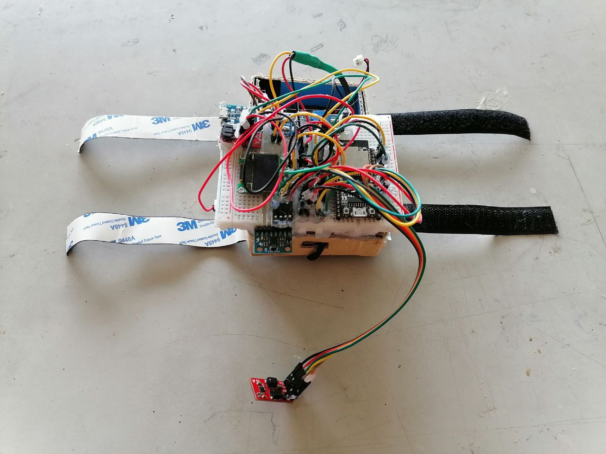

# ISDP RPMS
This is the GitHub repository for Integrated System Design Project (ISDP) with title Remote Patient Monitoring System (RPMS).

 

## Folder Description
- device_code: Arduino code for the device
- flutter_code: Flutter code for the Flutter app
 

# Video Demo
